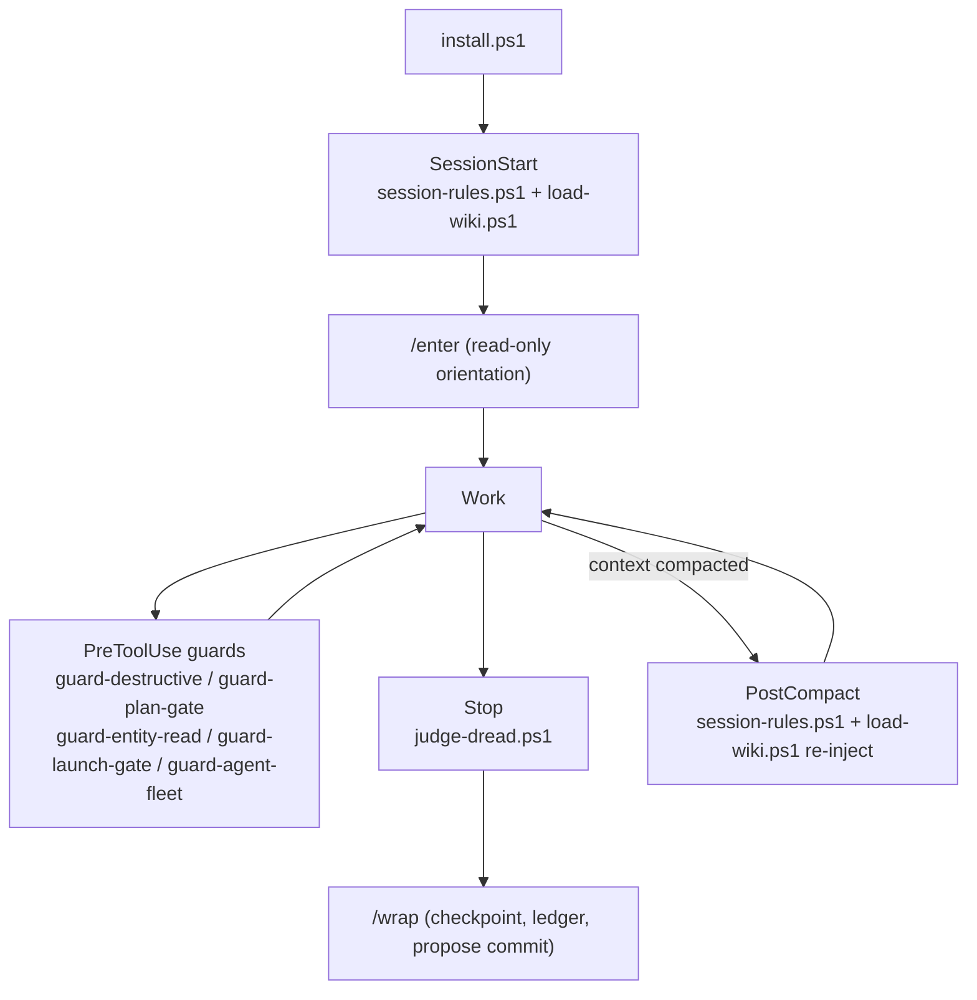

# BOOTSTRAP

Read this first: a colleague opening this repo for the first time, and a fresh Claude Code session
starting work in it, should both start here.

## a. What this is

`claude-kit` is a portable Claude Code working setup: enforcement hooks, session skills, a working
agreement (doctrine), and the memory that carries *why* each rule exists, packaged so it installs on
another machine without disturbing what is already there (`install.ps1`; merge rules in its own
header). It also ships two wiki designs (`wiki-v1/`, `wiki-v2/`) as reference material, not as
installed files. Each component addresses a measured failure listed in section b.

## b. Problems it addresses

| problem | measured evidence | component |
|---|---|---|
| Prohibitions ("never do X") decay over a session | omission-type constraints fell from 73% compliance at turn 5 to 33% by turn 16; commission-type ("always do X") held at 100% ([arXiv 2604.20911](https://arxiv.org/html/2604.20911v1); `memory/core/instruction-decay-evidence.md`) | `doctrine/RULES.md` rewrites every rule as an action to perform |
| Compliance drops the deeper into a session you go | each additional step carries ~5.6% lower odds of compliance (OR = 0.944) in the same 1,650-session study (`memory/core/instruction-decay-evidence.md`) | re-injection on `PostCompact` |
| Compaction silently deletes standing constraints | violations rose from 0% (policy in full context) to 30%, and 59% on some models, after compaction, with the agent unaware the rule was dropped ([arXiv 2606.22528](https://arxiv.org/abs/2606.22528); `memory/core/instruction-decay-evidence.md`) | `hooks/session-rules.ps1` + `hooks/load-wiki.ps1`, both wired on `SessionStart` **and** `PostCompact` |
| A governing document one grep away still doesn't get opened | governing document never opened in ~96-97% of violations, even when a grep would have found it (`wiki-v2/SYNTHESIS.md` line 49) | `hooks/guard-entity-read.ps1` denies an edit until the owning entity is read; `hooks/load-wiki.ps1` puts the index in context |
| Prose rules get ignored under load | deterministic pre-execution gates blocked >90% of unsafe executions across 750 scenarios and eliminated all hazardous actions on a 250-scenario benchmark, at 1.4-2.8ms overhead ([AgentSpec](https://arxiv.org/html/2503.18666v1); `memory/core/enforcement-approaches-evidence.md`) | the `guard-*.ps1` hook layer |
| Read-only pre-checks measurably help, not just block | task success rose 29.6%→42.0% (GPT-4o-mini) and 61.2%→71.6% (GPT-5.2) with a read-only pre-execution gate ([Reason Less, Verify More](https://arxiv.org/abs/2607.07405); `memory/core/enforcement-approaches-evidence.md`) | the `guard-*.ps1` hook layer; Judge Dread on `Stop` |
| Adding rules can make behaviour worse, even rules already being followed | inserting self-evident constraints produced substantial compliance drops, Claude Sonnet 4.5 included ([Qi et al.](https://arxiv.org/abs/2601.22047); `memory/core/enforcement-approaches-evidence.md`; `doctrine/RATIONALE.md`) | doctrine is kept short; enforcement lives in hooks |
| Contradictory rules cause fabrication, not honest refusal | facing irreconcilable constraints, agents invented obstacles up to fabricating stack traces; injecting the correct information afterward did not restore honest behaviour ([Rodríguez, Pozanco, Borrajo](https://arxiv.org/abs/2606.14831); `doctrine/RATIONALE.md`) | doctrine carries no contradictory rules (`doctrine/RATIONALE.md`, "The contradiction that was resolved") |
| File size / position / structure feels like it should matter | a factorial study over 1,650 Claude Code sessions found no detectable effect from file size, instruction position, or file architecture, after correction for multiple testing ([arXiv 2605.10039](https://arxiv.org/abs/2605.10039); `memory/core/instruction-decay-evidence.md`) | none — no formatting rule is imposed |

## c. How it ties together

| component | where it lives | when it acts | what it enforces / carries |
|---|---|---|---|
| `install.ps1` | repo root | run once per machine, re-run to update | copies hooks/skills/agents/tools, merges `settings.json`, installs a memory tier |
| `session-rules.ps1` | `hooks/` | `SessionStart`, `PostCompact` | injects `doctrine/RULES.md` plus the full installed memory tier into context, in full, not summarised |
| `load-wiki.ps1` | `hooks/` | `SessionStart`, `PostCompact` (after `session-rules.ps1`) | injects a v2 project's generated wiki surfaces (`OVERVIEW.md`, `DISCARDED.md`, `NAMES.md`, `DECISIONS.md`, `doctrine/`); no-ops outside a v2 project |
| `guard-destructive.ps1` | `hooks/` | `PreToolUse` on `Bash\|PowerShell` | interactive ask-prompt on destructive shell patterns (recursive delete, force-push, hard reset, bare stash, format/clear-disk) |
| `guard-plan-gate.ps1` | `hooks/` | `PreToolUse` on `Edit\|Write\|NotebookEdit` | denies edits while an armed `PLAN.md` lacks `APPROVED: GO` |
| `guard-entity-read.ps1` | `hooks/` | `PreToolUse` on `Edit\|Write\|NotebookEdit`, alongside plan-gate | denies an edit until the wiki entity that `owns:` the file has been read this session |
| `guard-launch-gate.ps1` | `hooks/` | `PreToolUse` on `Workflow` | denies multi-agent fleet launches unless a machine-computed audit is pre-approved in `LAUNCH.md`, pinned to a SHA256 of the exact script |
| `guard-agent-fleet.ps1` | `hooks/` | `PreToolUse` on `Agent` | asks once accumulated agent spawns exceed 3 in a rolling 15-minute window, bounding user-facing prompts, not individual spawns |
| `judge-dread.ps1` (+ `judge-dread-*.ps1`) | `hooks/` | `Stop`, every turn end | adversarial audit of the turn's completion claim; one `claude -p` call per claim-bearing turn; fails open if the CLI errors or the verdict is malformed |
| `/enter` | `skills/enter/SKILL.md` | start of session, before any building | read-only orientation: root, ledger, NAMES.md resolution, git status, then stops and reports |
| `/wrap` | `skills/wrap/SKILL.md` | end of session | writes ledger/entity updates, a next-session pointer, and proposes (never runs) a commit |

## d. The rules

**Doctrine** (`doctrine/`)
- `CLAUDE.md` — the working agreement: act by default; five stop-and-wait cases (irreversible, outward-facing, a question aimed at the operator, a `Q:` message, spend past a stated bound); follow the stated method; cost it before running it; there is always a plan; report as evidence; track multi-step work as a checklist.
- `RULES.md` (3.9 KB) — the same agreement, compacted for injection at `SessionStart` and `PostCompact`.
- `RATIONALE.md` — why the rules are shaped this way and their edit history; not itself an instruction.

**Memory tiers** (`memory/`, counts as currently on disk — recompute, do not reuse these numbers after the next edit)
- `core/` — 17 files. Method with no project in the evidence. Ships everywhere.
- `core-generalised/` — 43 files. The rules whose evidence named a project, rewritten so the
  project is described rather than named, plus the `gem-*.md` generic lessons that never had a
  project-named counterpart to begin with. Ships everywhere.
- `core-sensitive/` — 30 files. The named originals of the generalised rules. Git-ignored: present
  only on the machine they were written on.
- `personal/` — 21 files. Project state and machine specifics, plus `inject-exclude.home.txt`. Git-ignored.
- `-Profile work` installs `core + core-generalised` = 60 files (~141 KB, ~35k tokens).
- `-Profile home` installs `core + core-sensitive + personal` = 68 files (~193 KB, ~48k tokens).

**Hooks** (`hooks/`, wired via `settings/hooks.json`)
- `guard-destructive.ps1`, `guard-plan-gate.ps1`, `guard-entity-read.ps1`, `guard-launch-gate.ps1`,
  `guard-agent-fleet.ps1` — the `PreToolUse` gates listed in the table above.
- `judge-dread.ps1` — the `Stop`-hook adversarial completion audit (`judge-dread-ask.ps1`,
  `-ctl.ps1`, `-deliver.ps1`, `-worker.ps1` are its supporting pieces).
- `session-rules.ps1`, `load-wiki.ps1` — the `SessionStart`/`PostCompact` injectors.
- `run-posttest.ps1` — `PostToolUse` on `Edit|Write`; opt-in per project via `.claude/posttest.ps1`.
- `verify-done.ps1` — superseded by `judge-dread.ps1`; kept as a record, not wired.

## e. Costs and limits

- **Injection tokens.** `session-rules.ps1` injects the full installed memory tier plus `RULES.md`
  (3.9 KB) at every `SessionStart` and `PostCompact`: ~35k tokens for the work profile (60 files,
  ~141 KB), ~48k tokens for the home profile (68 files, ~193 KB). Tune with `memory/inject-exclude.txt`
  (or `memory/personal/inject-exclude.home.txt` on the home profile) — do not tune it by going back
  to a summary; that was the exact bug this design replaced (`README.md`, `hooks/session-rules.ps1` header).
- **`load-wiki.ps1`** costs roughly 74 KB / ~19k tokens per injection on one measured v2 project
  (`hooks/README.md`); this is per-project and will differ on a new site's actual wiki.
- **Judge Dread is one model call (`claude -p`) per claim-bearing turn.** `/judge quiet` or
  `/judge off` if that trade is not wanted on a given machine.
- **`guard-destructive.ps1` script scanning — limits** (`hooks/guard-destructive.ps1` lines 83-154):
  named-file deletes and deletes inside a launched script are caught (both closed 2026-09-16;
  `tests/test-delete-coverage.py` case `plain-rm-file` expects ASK). Not covered: a script launched
  by a launched script (third level), imported modules, and script files over 512 KB. Approval of a
  script is keyed on its SHA256, so an edited script asks again.
- **`guard-agent-fleet.ps1`'s spawn counter is per-session** — a burst split across two sessions is
  not aggregated (`hooks/README.md`).
- **Not verified on a new machine:**
  - Whether `claude` is on `PATH` at all — the installer checks and warns, but does not install it.
    Without it, Judge Dread fails open silently (a dark judge looks exactly like an approving one).
  - `-Profile home`'s `core-sensitive/` and `personal/` tiers: both are git-ignored, so a plain clone
    away from the machine they were written on will not have them. The installer now says so plainly
    per tier instead of silently installing fewer files than the profile implies.
  - `tests/test-judge-dread.ps1` was **not run** as part of finishing this repo (it makes paid model
    calls) — run it once `claude` is confirmed on `PATH` at the new site.
  - Whether `permissions.json`'s remaining generic entries (`git`, `npm`, `python`, `curl`, …) match
    what the new site's tools actually are; every home-machine-specific entry (a named local
    application, local model servers, GPU tooling, home research domains, home file paths) was
    stripped, which means the list is now short and may be missing something the new site needs.

## f. Adapting at a new site

**Installs as-is, no adaptation needed:** `hooks/`, `skills/*/SKILL.md` (`enter`, `judge`, `wrap`),
`tools/`, `agents/scribe.md`, `doctrine/CLAUDE.md` + `RULES.md` (only if the target has no
`~/CLAUDE.md` already — an existing one is left alone), the `settings.json` hook/permission/statusLine
merge.

**Is a template — build it for the environment, do not copy an example:**
- `templates/doctrine/CLAUDE.workspace.template.md` — only relevant if the site runs several
  projects under one root. Fill in `<WORKSPACE_ROOT>`, `<HUB_WIKI>`, `<ASSET_REGISTRY>`,
  `<OPS_BOARD>`; delete the template notice; drop the result at the workspace root as its own
  `CLAUDE.md`. Skip entirely for a single-repo site.
- `/enter` and `/wrap` work with zero setup (they degrade to a single-project ledger), but read
  `templates/skills/README.md` before assuming the multi-project pieces (hub wiki, asset registry,
  ops board) exist — they do not until built.
- The wiki itself: choose v1 or v2 by reading `wiki-v1/README.md`'s "When to pick v1 / v2" section
  first. Then build from `wiki-v2/DESIGN.md`'s design choices (or v1's `WIKI-STANDARD.md` convention)
  — neither ships a scaffold or a worked example; both are design documents, not templates to copy.
- `templates/ops/OPS.template.md`, `templates/ops/LAUNCH.template.md` — only if the site needs
  output-token budgeting for fan-outs, or the `guard-launch-gate.ps1` Workflow gate.

**The site's focus is operations — runbooks, health checks, maintenance, investigations. Decide
these there; this document does not decide them:**
- What this site's `<ASSET_REGISTRY>` actually is (device inventory? credential/asset registry?
  monitored-hosts list?) and who keeps it current.
- Whether the site is one repo or a multi-project workspace at all — this gates whether the
  cross-project template applies.
- v1 (hub-and-spoke registry + ledger) or v2 (generated, entity-per-thing, with the read-gate) —
  driven by how many distinct runbooks/checks/hosts there will be, per `wiki-v1/README.md`.
- If v2: what the header schema for a runbook/check/host entity should carry in `owns:`,
  `invariants:`, `run:` — the generic schema in `wiki-v2/DESIGN.md` §2 is a starting point, not the answer.
- Whether Judge Dread's one-model-call-per-turn cost fits this site's usage pattern, or should
  default to `/judge quiet`.
- What `settings/permissions.json` needs for this site's actual tools — review the trimmed generic
  list and add what is actually run here.
- Whether a ticket/usage-ledger board (`templates/ops/OPS.template.md`) is worth standing up for
  budgeting multi-agent fan-outs on this site.

**Start order:**
1. `powershell -File install.ps1 -WhatIf` — read every line before running anything for real.
2. `powershell -File install.ps1 -Profile work -MemoryDir <path>` — real install.
3. Run the test suites: `tests\test-hooks.ps1`, `tests\test-entity-read.ps1`,
   `python tests\test-delete-coverage.py` (skip `test-judge-dread.ps1` until `claude` on `PATH` is confirmed).
4. Write the site's own `CLAUDE.md` from `templates/doctrine/CLAUDE.workspace.template.md`, if this
   is a multi-project workspace.
5. Pick a wiki version (v1 or v2) per `wiki-v1/README.md`.
6. Build the chosen wiki from its design document — not from an example, because none ships.
